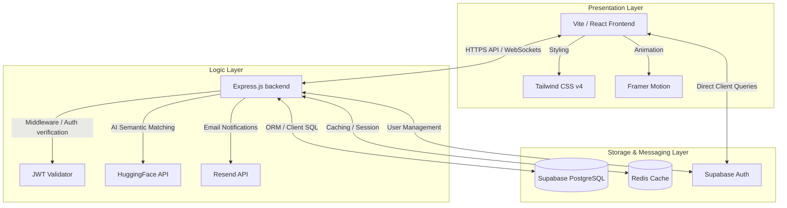
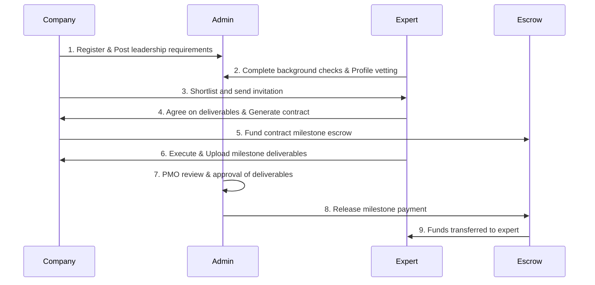

# 💼 ExigentCX

[](https://cxo-ten.vercel.app)
[](https://react.dev)
[](https://expressjs.com)
[](https://supabase.com)

**Leadership On-Demand Marketplace** — A secure digital platform connecting high-growth organizations with verified senior executives, advisors, and consultants for fractional, interim, and strategic engagements.

---

## 🔗 Live Application

The application is deployed and hosted at:
👉 **[https://cxo-ten.vercel.app](https://cxo-ten.vercel.app)**

---

## 📖 Table of Contents

- [Introduction](#1-introduction)
- [Problem Statement](#2-problem-statement)
- [Platform Concept](#3-platform-concept)
- [System Architecture](#4-system-architecture)
- [Key Features & Modules](#5-key-features--modules)
- [Database Schema](#6-database-schema)
- [Directory Structure](#7-directory-structure)
- [Getting Started](#8-getting-started)
- [Workflow of the Platform](#9-workflow-of-the-platform)
- [Future Roadmap](#10-future-roadmap)

---

## 1. Introduction

ExigentCX is a digital marketplace platform designed to connect organizations with experienced senior professionals such as CXOs, advisors, consultants, and directors. Many companies, especially startups and small to medium enterprises (SMEs), require strategic leadership but cannot justify or afford full-time executive hires. Conversely, seasoned professionals seek flexible opportunities to deploy their expertise.

ExigentCX bridges this gap by creating a trusted ecosystem where companies can discover, vet, and engage experienced leaders. To ensure trust, transparency, and effective delivery, the platform integrates an administrative and Project Management Office (PMO) layer that governs vetting, engagement monitoring, and escrow-based payment systems.

---

## 2. Problem Statement

Organizations frequently encounter barriers when searching for high-level leadership expertise:
* **Cost & Commitment:** Full-time CXO recruitment is expensive, slow, and comes with high long-term commitments.
* **Granular Needs:** Companies often need advice or execution control only for short-term projects, transformation initiatives, or specific strategic challenges.
* **Lack of Trust:** Traditional freelance platforms do not offer the rigorous vetting, contract security, or project governance required for executive-level engagements.

---

## 3. Platform Concept

The platform operates as a managed two-sided marketplace governed by a PMO layer:

```
┌──────────────┐         ┌───────────────────┐         ┌──────────────┐
│  Companies   │ ◄─────► │ Admin / PMO Team  │ ◄─────► │  Advisors    │
│  (Clients)   │         │  (Governs & Vets) │         │    (CXOs)    │
└──────────────┘         └───────────────────┘         └──────────────┘
```

1. **Company Users:** Create business profiles, post leadership projects, browse vetted executive talent, shortlist, and fund escrow accounts.
2. **Professional Users (CXOs):** Complete verification, build portfolios, apply for fractional roles, and submit deliverables.
3. **Admin / PMO Team:** Performs profile vetting, verifies expert background credentials, monitors milestone fulfillment, and administers dispute resolutions.

---

## 4. System Architecture

ExigentCX utilizes a modern, multi-layered architecture designed for high availability, security, and real-time responsiveness.



### Architectural Components

1. **Presentation Layer (Frontend)**:
   - Built with **React 19 & Vite** for lightning-fast loads and modern development lifecycle.
   - Styled with **Tailwind CSS v4** for clean UI design and token-based layouts.
   - Enhanced with **Framer Motion** for premium interactive micro-animations.
   - Utilizes **React Router DOM** for client routing and **React Hook Form** for structured onboarding/wizards.
2. **Application Layer (Backend)**:
   - **Express.js (v5)** REST API providing endpoints for core business rules (matching, payments, escrow management).
   - **HuggingFace Inference API** used to calculate embeddings and perform semantic matching between company requirements and advisor profiles.
   - **Resend integration** for transactional emails (invitations, milestone updates, payments).
3. **Data & Infrastructure Layer**:
   - **Supabase (PostgreSQL)**: Core relational database storing profiles, requirements, contracts, applications, and logs.
   - **Supabase Authentication**: Secure user management and login sessions.
   - **Redis (ioredis)**: High-speed caching layer for sessions, temporary verification tokens, and hot metadata.

---

## 5. Key Features & Modules

### 🏢 Company Module
* **Company Registration & Profile:** Onboard organizations with company info, industry, and scale metrics.
* **Requirement Wizard:** Step-by-step assistant for publishing roles, deliverables, and budgets.
* **AI Matching:** Match company needs with the most relevant vetted advisors.
* **Milestone Dashboard:** Monitor progress and release funds to professionals.

### 💼 Professional (CXO) Module
* **Profile Verification:** Detailed experience verification workflow.
* **Engagement Workspace:** Accept contracts, interact with client reps, and submit milestone proofs.
* **Payment Tracker:** View upcoming, pending, and released payments.

### 🛡️ Admin & Governance Module
* **Vetting Center:** Background and CV vetting queues.
* **Escrow Management:** Secure holding and payout of project budgets.
* **Dispute Center:** PMO tools to arbitrate and refund/release contracts.

---

## 6. Database Schema

The core PostgreSQL database runs on Supabase and manages:

* `company_applications`: Handles user applications to register companies.
* `company_requirements`: Stores job posts, goals, duration, budget, and skills requested.
* `expert_applications`: Captures registrations and CV details of advisors.
* `contracts`: Binds the client and expert, tracking milestone statuses, active periods, and values.
* `invitations`: Logs requests sent by companies to shortlisted candidates.
* `notifications`: Keeps users informed of changes in application or contract state.

---

## 7. Directory Structure

```
├── backend/                  # Node.js + Express API server
│   ├── controllers/          # Express route controllers
│   ├── middlewares/          # Security and request verification middleware
│   ├── routes/               # REST API endpoints
│   ├── utils/                # Supabase configuration, HuggingFace wrapper, etc.
│   └── server.js             # API entrypoint
├── frontend_1/               # Primary React Frontend (Vercel deployment)
│   ├── src/                  # React source files (components, contexts, hooks)
│   ├── index.html            # Vite template
│   └── package.json          # Frontend dependencies (React 19, Tailwind CSS v4)
└── README.md                 # Project documentation
```

---

## 8. Getting Started

### Prerequisites
* **Node.js** (v18 or higher)
* **npm** or **yarn**

### Setting Up Environment Variables

#### Backend (`/backend/.env`)
```env
PORT=5000
SUPABASE_URL=your_supabase_project_url
SUPABASE_SERVICE_ROLE_KEY=your_supabase_service_role_key
HUGGINGFACE_API_KEY=your_huggingface_key
REDIS_URL=redis://localhost:6379
RESEND_API_KEY=your_resend_key
FRONTEND_URL=https://cxo-ten.vercel.app
```

#### Frontend (`/frontend_1/.env`)
```env
VITE_SUPABASE_URL=your_supabase_project_url
VITE_SUPABASE_ANON_KEY=your_supabase_anon_key
VITE_API_URL=http://localhost:5000/api
```

### Installation & Run

1. **Clone the repository**
   ```bash
   git clone <repo-url>
   cd CXO
   ```

2. **Run Backend**
   ```bash
   cd backend
   npm install
   npm start
   ```

3. **Run Frontend**
   ```bash
   cd frontend_1
   npm install
   npm run dev
   ```

---

## 9. Workflow of the Platform



---

## 10. Future Roadmap

* **AI Recommendation Engine:** Fully automated rank-matching of experts using advanced LLM profiles.
* **In-app Chat & Meeting Scheduler:** Integrated chat tools and scheduling for direct interviews.
* **Global Legal Compliance Check:** Automatic local NDA and tax generation (e.g. W8/W9 forms).
* **Expert Masterclasses:** Professional development and peer-to-peer executive advisory groups.
